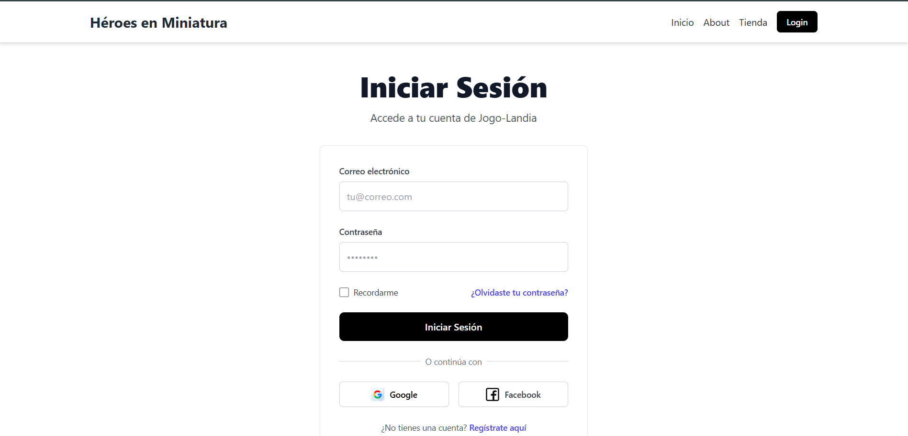
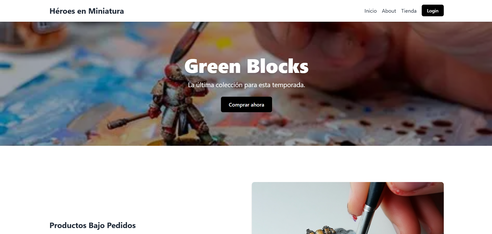
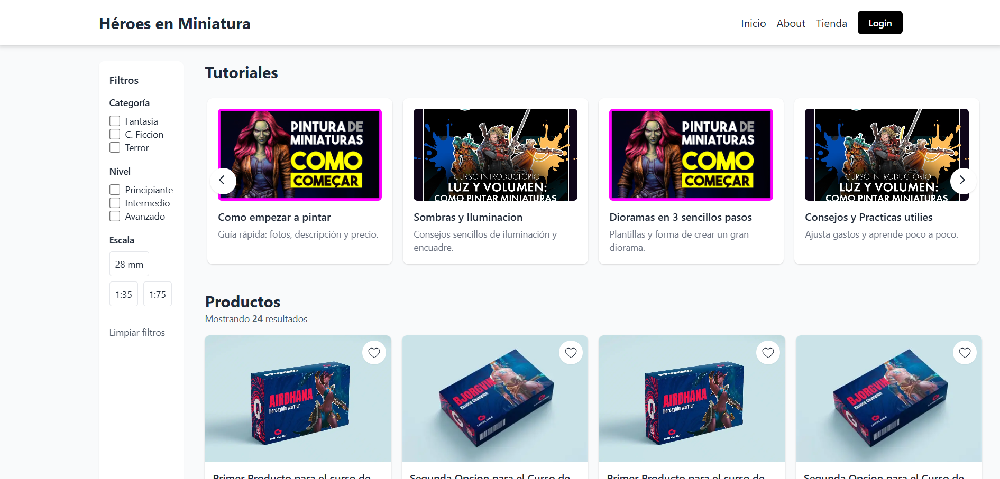
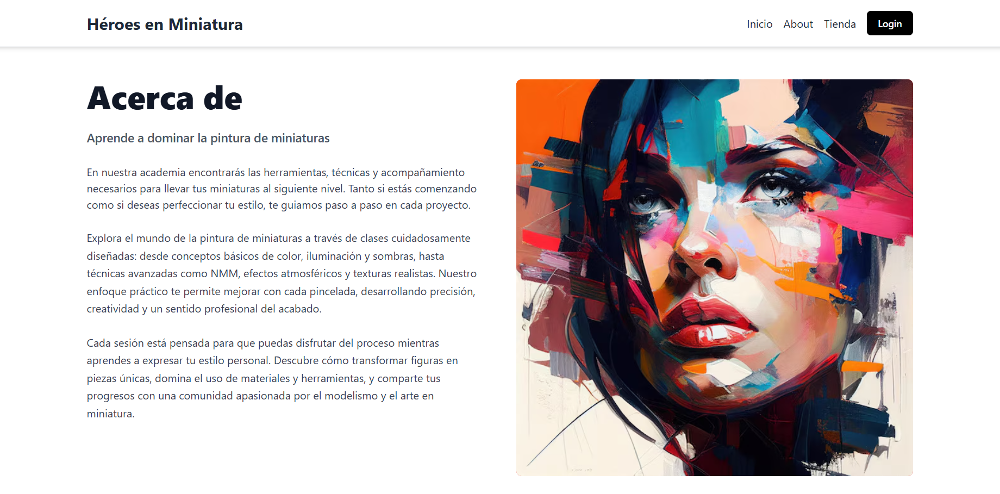
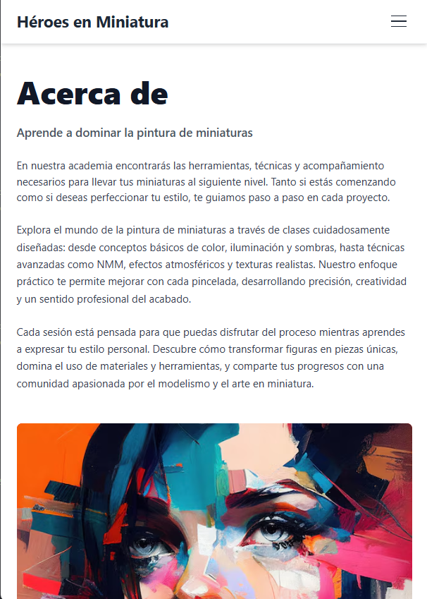

# Guía de Estilo - Web Designing Miniatures

## 📋 Índice
1. [Framework y Tecnologías](#framework-y-tecnologías)
2. [Paleta de Colores](#paleta-de-colores)
3. [Tipografía](#tipografía)
4. [Layout y Espaciado](#layout-y-espaciado)
5. [Componentes Comunes](#componentes-comunes)
6. [Botones](#botones)
7. [Formularios](#formularios)
8. [Imágenes](#imágenes)
9. [Responsive Design](#responsive-design)
10. [Patrones de Diseño](#patrones-de-diseño)

---

## Framework y Tecnologías

### Framework CSS
- **Tailwind CSS** (vía CDN): `https://cdn.tailwindcss.com`
- Todos los estilos se aplican mediante clases utilitarias de Tailwind
- No se utilizan archivos CSS personalizados (excepto estilos mínimos en algunos archivos)

### JavaScript
- **header.js**: Script común para cargar el header dinámicamente en todas las páginas
- Se incluye en todas las páginas HTML mediante: `<script src="header.js"></script>`

---

## Paleta de Colores

### Colores Principales

#### Fondo
- **Blanco**: `bg-white` - Fondo principal de la mayoría de páginas
- **Gris claro**: `bg-gray-50` - Fondo alternativo (Landing.html)
- **Gris oscuro**: `bg-gray-900` - Footer en algunas páginas

#### Texto
- **Negro/Gris oscuro**: `text-gray-900` - Títulos principales
- **Gris medio**: `text-gray-800` - Texto del body
- **Gris**: `text-gray-700` - Texto secundario
- **Gris claro**: `text-gray-600` - Texto descriptivo
- **Gris muy claro**: `text-gray-500` - Texto terciario/metadatos
- **Blanco**: `text-white` - Texto sobre fondos oscuros

#### Acentos
- **Negro**: `bg-black` - Botones principales, footer inferior
- **Indigo**: `text-indigo-600` - Enlaces hover, botones secundarios
- **Rojo**: `border-red-500` - Bordes de testimonios (Landing.html)

#### Bordes
- **Gris claro**: `border-gray-200`, `border-gray-300` - Bordes de formularios y separadores
- **Gris oscuro**: `border-gray-700` - Bordes en footers oscuros

### Ejemplos de Uso
```html
<!-- Fondo principal -->
<body class="bg-white text-gray-800">

<!-- Título principal -->
<h1 class="text-4xl font-extrabold text-gray-900">

<!-- Texto descriptivo -->
<p class="text-gray-600">

<!-- Botón principal -->
<button class="bg-black text-white">
```

---

## Tipografía

### Jerarquía de Títulos

#### H1 - Títulos Principales
- **Clases**: `text-4xl sm:text-5xl font-extrabold text-gray-900`
- **Uso**: Títulos de página principales
- **Ejemplo**: Login, About, Article

#### H2 - Títulos de Sección
- **Clases**: `text-2xl font-bold` o `text-3xl font-bold`
- **Uso**: Encabezados de secciones
- **Espaciado**: `mb-8` o `mb-4`

#### H3 - Subtítulos
- **Clases**: `text-lg font-semibold` o `text-xl font-semibold`
- **Uso**: Subtítulos dentro de secciones

#### H4 - Subtítulos Menores
- **Clases**: `text-lg font-semibold`
- **Uso**: Subtítulos de nivel inferior

### Texto de Cuerpo
- **Tamaño base**: `text-base` (por defecto en Tailwind)
- **Tamaño grande**: `text-lg` - Para párrafos destacados
- **Tamaño pequeño**: `text-sm` - Para metadatos, descripciones secundarias
- **Tamaño extra pequeño**: `text-xs` - Para copyright, detalles menores

### Peso de Fuente
- **Extrabold**: `font-extrabold` - Títulos principales
- **Bold**: `font-bold` - Títulos de sección, nombres de marca
- **Semibold**: `font-semibold` - Subtítulos, botones, elementos destacados
- **Medium**: `font-medium` - Labels, texto importante
- **Normal**: Por defecto - Texto de cuerpo

### Ejemplos
```html
<!-- Título principal -->
<h1 class="text-4xl sm:text-5xl font-extrabold text-gray-900 mb-4">

<!-- Título de sección -->
<h2 class="text-2xl font-bold mb-8">

<!-- Texto de cuerpo -->
<p class="text-gray-700 leading-relaxed">
```

---

## Layout y Espaciado

### Contenedor Principal
- **Clase**: `max-w-7xl mx-auto px-4 sm:px-6 lg:px-8`
- **Uso**: Contenedor principal de todas las páginas
- **Ancho máximo**: 7xl (80rem / 1280px)
- **Padding responsive**: 
  - Móvil: `px-4` (1rem)
  - Tablet: `sm:px-6` (1.5rem)
  - Desktop: `lg:px-8` (2rem)

### Contenedores de Contenido
- **Ancho medio**: `max-w-4xl mx-auto` - Para artículos, formularios
- **Ancho estrecho**: `max-w-2xl mx-auto` - Para texto de lectura
- **Ancho estrecho para formularios**: `max-w-md mx-auto` - Para formularios de login

### Espaciado Vertical
- **Padding superior/inferior**: `py-12` - Padding principal del main
- **Márgenes entre secciones**: `mb-16`, `mb-20` - Separación entre secciones grandes
- **Espaciado interno**: `p-4`, `p-6`, `p-8` - Padding interno de cards y contenedores

### Grid System
- **Grid responsive**: `grid grid-cols-1 md:grid-cols-2 lg:grid-cols-3`
- **Gap estándar**: `gap-4`, `gap-6`, `gap-8` - Espaciado entre elementos del grid

### Ejemplos
```html
<!-- Contenedor principal -->
<main class="max-w-7xl mx-auto px-4 sm:px-6 lg:px-8 py-12">

<!-- Grid de productos -->
<div class="grid grid-cols-2 sm:grid-cols-3 lg:grid-cols-4 gap-4">

<!-- Sección con espaciado -->
<section class="mb-16">
```

---

## Componentes Comunes

### Header
- **Fondo**: `bg-white`
- **Sombra**: `shadow-md` o `shadow-sm`
- **Borde inferior**: `border-b border-gray-100`
- **Altura**: `py-4` (padding vertical)
- **Logo/Título**: `text-2xl font-bold text-gray-800`
- **Navegación**: 
  - Desktop: `hidden md:flex space-x-4`
  - Móvil: Menú hamburguesa con `md:hidden`

### Footer
- **Estructura estándar**:
  - Fondo: `bg-white border-t border-gray-200`
  - Grid: `grid grid-cols-2 md:grid-cols-5 gap-8`
  - Título de marca: `font-bold mb-3 text-gray-900`
  - Enlaces: `text-sm text-gray-500` con `hover:text-gray-800`
- **Footer inferior** (copyright):
  - Fondo: `bg-black text-white text-center py-2 text-xs`
  - Texto: `© 2024 Jogo-Landia. Todos los derechos reservados.`

### Cards/Tarjetas
- **Fondo**: `bg-white`
- **Sombra**: `shadow-sm`, `shadow-md`, `shadow-lg`
- **Bordes redondeados**: `rounded-lg`
- **Padding**: `p-4`, `p-6`, `p-8`
- **Overflow**: `overflow-hidden` - Para imágenes dentro de cards

### Separadores
- **Línea horizontal**: `<hr class="border-gray-300 my-12">` o `border-gray-200`
- **Uso**: Separar secciones principales

---

## Botones

### Botón Principal
```html
<button class="bg-black text-white px-6 py-2 rounded-md font-semibold hover:bg-gray-700 transition">
    Texto del botón
</button>
```
- **Fondo**: Negro (`bg-black`)
- **Texto**: Blanco (`text-white`)
- **Padding**: `px-6 py-2` o `px-6 py-3` para botones más grandes
- **Bordes**: `rounded-md` (redondeado medio)
- **Hover**: `hover:bg-gray-700`
- **Transición**: `transition` para animación suave
- **Ancho completo**: `w-full` cuando el botón ocupa todo el ancho

### Botón Secundario
```html
<button class="border border-gray-400 text-gray-800 px-6 py-2 rounded-md font-semibold hover:bg-gray-100 transition">
    Texto del botón
</button>
```
- **Estilo**: Borde con fondo transparente
- **Borde**: `border border-gray-400`
- **Texto**: `text-gray-800`
- **Hover**: `hover:bg-gray-100`

### Botón de Login (Header)
```html
<button class="bg-black text-white px-4 py-2 rounded-sm font-semibold text-xs ml-4 hover:bg-gray-700 transition">
    Login
</button>
```
- **Tamaño**: Más pequeño (`text-xs`, `px-4 py-2`)
- **Bordes**: `rounded-sm` (menos redondeado)

### Botones de Redes Sociales
```html
<button class="flex items-center justify-center px-4 py-2 border border-gray-300 rounded-md shadow-sm text-sm font-medium text-gray-700 bg-white hover:bg-gray-50 transition">
    <span class="mr-2"></span>
    Google
</button>
```

---

## Formularios

### Estructura de Campos
```html
<div>
    <label for="email" class="block text-sm font-medium text-gray-700 mb-2">
        Correo electrónico
    </label>
    <input type="email" 
           name="email" 
           id="email" 
           placeholder="tu@correo.com" 
           required 
           class="block w-full border border-gray-300 rounded-md shadow-sm p-3 focus:ring-black focus:border-black transition">
</div>
```

### Características de Inputs
- **Label**: `block text-sm font-medium text-gray-700 mb-2`
- **Input**: 
  - `block w-full` - Ancho completo
  - `border border-gray-300` - Borde gris
  - `rounded-md` - Bordes redondeados
  - `shadow-sm` - Sombra sutil
  - `p-3` - Padding interno
  - `focus:ring-black focus:border-black` - Focus en negro
  - `transition` - Transición suave

### Checkboxes
```html
<input type="checkbox" 
       class="h-4 w-4 text-black focus:ring-black border-gray-300 rounded">
```

### Textarea
```html
<textarea rows="4" 
          class="mt-1 block w-full border border-gray-300 rounded-md shadow-sm p-3 focus:ring-black focus:border-black">
</textarea>
```

### Formularios Completos
- **Contenedor**: `space-y-6` - Espaciado vertical entre campos
- **Fondo del formulario**: `bg-white p-8 rounded-lg shadow-sm border border-gray-200`
- **Grid para campos lado a lado**: `grid grid-cols-1 sm:grid-cols-2 gap-4`

---

## Imágenes

### Imágenes Principales
```html

```
- **Tamaño**: `w-full h-full` o `w-full h-auto`
- **Ajuste**: `object-cover` - Cubre el contenedor manteniendo proporción
- **Contenedor**: `rounded-lg` o `rounded-md` para bordes redondeados

### Imágenes en Cards
```html
<div class="w-full h-48 bg-gray-200 rounded-md overflow-hidden">
    
</div>
```
- **Altura fija**: `h-48` (12rem) para productos
- **Aspect ratio video**: `aspect-video` para imágenes de tutoriales

### Imágenes Hero/Banner
```html
<div class="relative h-96 flex items-center justify-center">
    <div class="absolute inset-0 bg-gray-700 bg-opacity-50">
        
    </div>
    <div class="relative z-10 text-white">
        <!-- Contenido sobre la imagen -->
    </div>
</div>
```

### Logos de Redes Sociales
```html

```
- **Tamaño estándar**: `w-6 h-6` (1.5rem)

---

## Responsive Design

### Breakpoints de Tailwind
- **sm**: 640px - Tablets pequeñas
- **md**: 768px - Tablets
- **lg**: 1024px - Desktop pequeño
- **xl**: 1280px - Desktop
- **2xl**: 1536px - Desktop grande

### Patrones Responsive Comunes

#### Grid Responsive
```html
<!-- 1 columna móvil, 2 tablet, 3 desktop -->
<div class="grid grid-cols-1 md:grid-cols-2 lg:grid-cols-3 gap-8">
```

#### Flex Responsive
```html
<!-- Columna en móvil, fila en desktop -->
<div class="flex flex-col md:flex-row gap-8">
```

#### Texto Responsive
```html
<!-- Tamaño de texto adaptativo -->
<h1 class="text-2xl sm:text-3xl md:text-4xl lg:text-5xl">
```

#### Padding Responsive
```html
<!-- Padding adaptativo -->
<div class="px-4 sm:px-6 lg:px-8">
```

#### Visibilidad Responsive
```html
<!-- Oculto en móvil, visible en desktop -->
<div class="hidden md:block">

<!-- Visible en móvil, oculto en desktop -->
<div class="md:hidden">
```

### Menú Móvil
- **Botón hamburguesa**: Visible solo en móvil (`md:hidden`)
- **Menú desplegable**: Oculto por defecto, se muestra con JavaScript
- **Menú desktop**: Visible solo en `md` y superior (`hidden md:flex`)

---

## Patrones de Diseño

### Hero Section
```html
<section class="relative h-96 flex items-center justify-center text-center mb-16">
    <div class="absolute inset-0 bg-gray-700 bg-opacity-50">
        
    </div>
    <div class="relative z-10 text-white">
        <h1 class="text-4xl sm:text-6xl font-extrabold mb-4 drop-shadow-lg">Título</h1>
        <p class="text-xl mb-6 drop-shadow-md">Subtítulo</p>
        <button class="bg-black text-white px-6 py-3 rounded-md font-semibold hover:bg-gray-700 transition">
            CTA
        </button>
    </div>
</section>
```

### Sección de Contenido Alternado
```html
<!-- Texto izquierda, imagen derecha -->
<div class="flex flex-col md:flex-row gap-8 items-center">
    <div class="md:w-1/2 space-y-4">
        <!-- Contenido -->
    </div>
    <div class="md:w-1/2">
        
    </div>
</div>

<!-- Imagen izquierda, texto derecha (con reverse) -->
<div class="flex flex-col md:flex-row md:flex-row-reverse gap-8 items-center">
    <!-- Mismo contenido pero invertido -->
</div>
```

### Grid de Productos
```html
<div class="grid grid-cols-2 sm:grid-cols-3 lg:grid-cols-4 gap-4">
    <article class="bg-white rounded-lg shadow overflow-hidden">
        <div class="relative">
            
            <button class="absolute top-2 right-2 bg-white p-2 rounded-full shadow-sm">
                <!-- Icono favorito -->
            </button>
        </div>
        <div class="p-3">
            <h3 class="font-medium">Título</h3>
            <p class="text-sm text-gray-500">Descripción</p>
            <div class="mt-2 flex items-center justify-between">
                <div class="font-semibold">€25</div>
                <button class="text-xs text-indigo-600">Ver</button>
            </div>
        </div>
    </article>
</div>
```

### Testimonios/Citas
```html
<blockquote class="bg-white p-6 rounded-lg shadow-md border-l-4 border-red-500">
    <p class="italic mb-4">"Texto del testimonio"</p>
    <footer class="flex items-center text-sm">
        <div class="w-8 h-8 bg-gray-300 rounded-full mr-3"></div>
        <div>
            <p class="font-semibold">Nombre</p>
            <p class="text-gray-500">Función</p>
        </div>
    </footer>
</blockquote>
```

### Carrusel/Tutoriales
- **Contenedor**: `overflow-x-auto scrollbar-hide snap-x snap-mandatory`
- **Items**: `snap-center flex-shrink-0 w-[80%] sm:w-[48%] md:w-[36%] lg:w-[280px]`
- **Navegación**: Botones con flechas absolutas

---

## Convenciones de Nomenclatura

### Clases Tailwind
- Seguir el orden estándar: `display`, `position`, `spacing`, `sizing`, `colors`, `typography`, `effects`
- Agrupar clases relacionadas

### Estructura de Archivos
- Todos los HTML incluyen: `<script src="header.js"></script>`
- Todos usan Tailwind vía CDN
- Idioma: `lang="es"` en todos los HTML

### Nombres de Clases Personalizadas
- Mínimas clases personalizadas (solo en casos específicos como `carousel-arrow`)
- Preferir clases utilitarias de Tailwind

---

## Notas Importantes

1. **Consistencia**: Mantener los mismos patrones de color, espaciado y tipografía en todas las páginas
2. **Accesibilidad**: Usar `alt` en todas las imágenes, `aria-label` en botones sin texto
3. **Performance**: Las imágenes deben tener `loading="lazy"` cuando sea apropiado
4. **Responsive First**: Diseñar primero para móvil, luego adaptar a pantallas mayores
5. **Transiciones**: Usar `transition` en elementos interactivos para mejor UX

---

## Ejemplos de Páginas

### Login.html
- Formulario centrado con `max-w-md mx-auto`
- Fondo blanco
- Botones de redes sociales en grid de 2 columnas




### Shop.html
- Hero section con imagen de fondo
- Contenido alternado (texto/imagen)



### List.html
- Sidebar de filtros (sticky en desktop)
- Grid de productos responsive
- Carrusel de tutoriales



### About.html
- Layout de 2 columnas (texto/imagen)
- Formulario de contacto al final




---

**Última actualización**: Diciembre 2024
**Versión**: 1.0

